# Sahejreet Singh — Portfolio Site

Roll no - 2025101089

Website link - https://web.iiit.ac.in/~sahejreet.sethi/

A personal portfolio site for Sahejreet Singh, CSE undergraduate at IIIT Hyderabad. Built with vanilla HTML, CSS, and JavaScript — no frameworks, no build tools, no libraries.

---

## Pages

| File | Route |
|---|---|
| `index.html` | Home |
| `about.html` | About |
| `projects.html` | Projects |
| `contact.html` | Contact |

---

## Validation & Accessibility Audits

### Lighthouse Reports

Performance, accessibility, best practices, and SEO scores for all four pages.

**Home (`index.html`)**
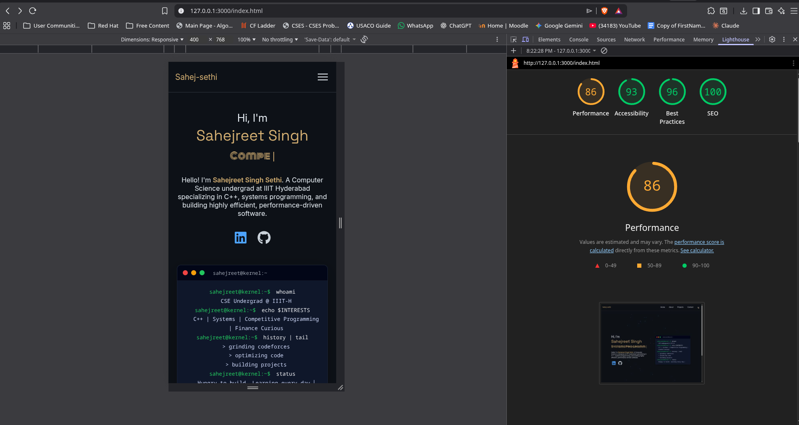

**About (`about.html`)**
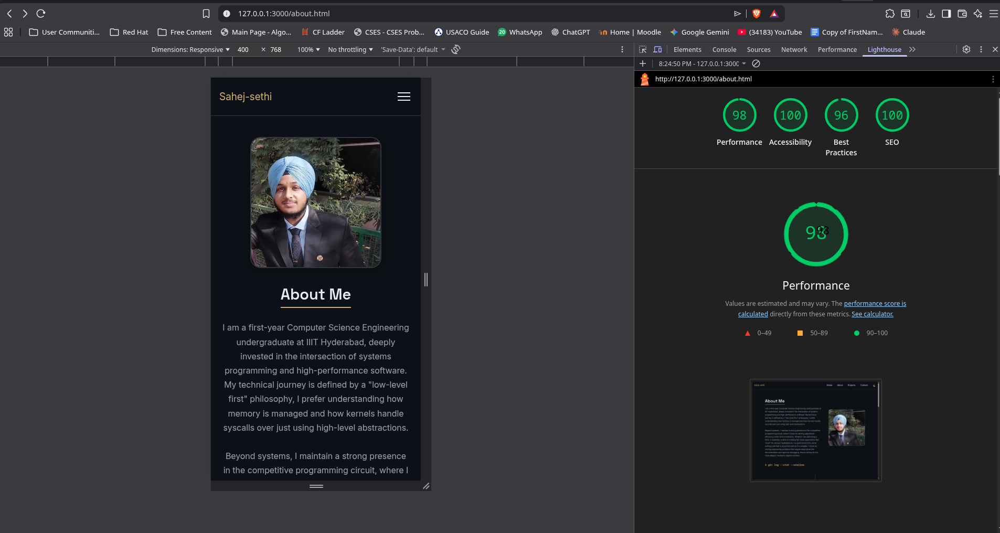

**Projects (`projects.html`)**
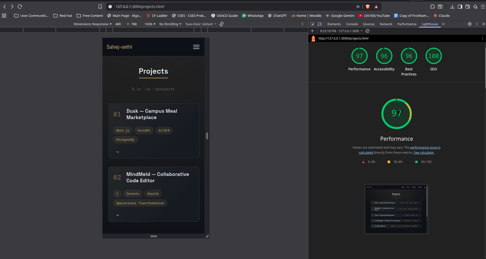

**Contact (`contact.html`)**
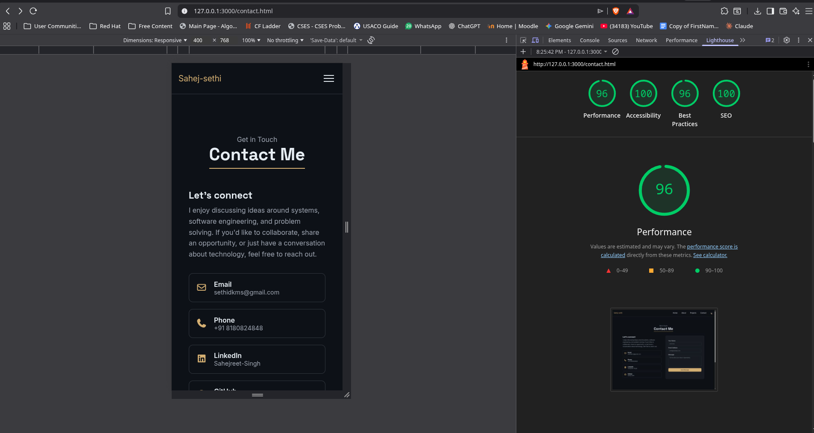

---

### W3C HTML Validation

All four pages pass W3C markup validation with no errors.

**Home (`index.html`)**
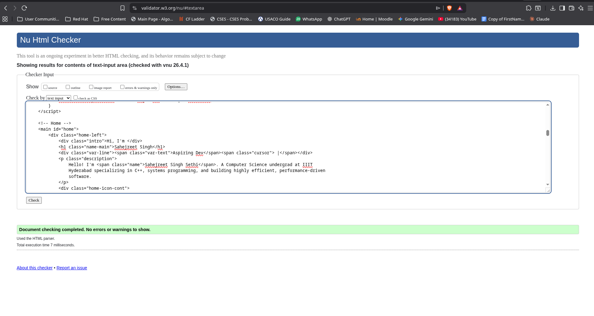

**About (`about.html`)**
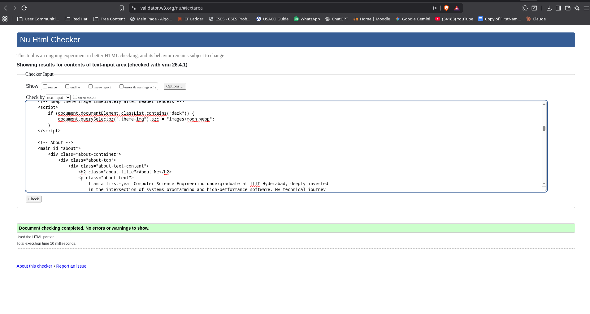

**Projects (`projects.html`)**
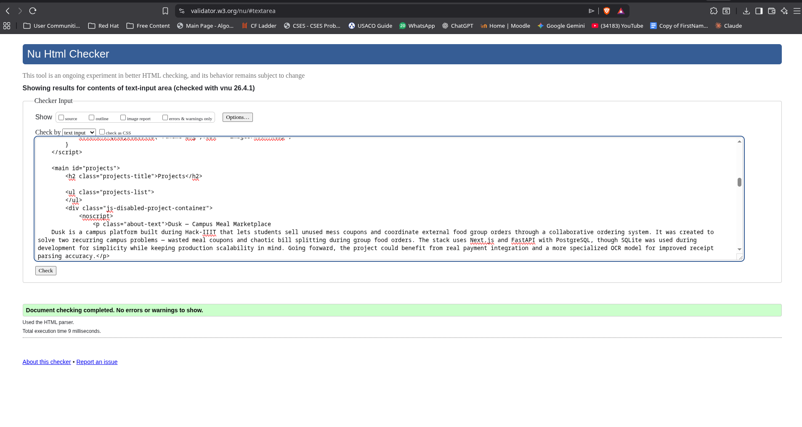

**Contact (`contact.html`)**
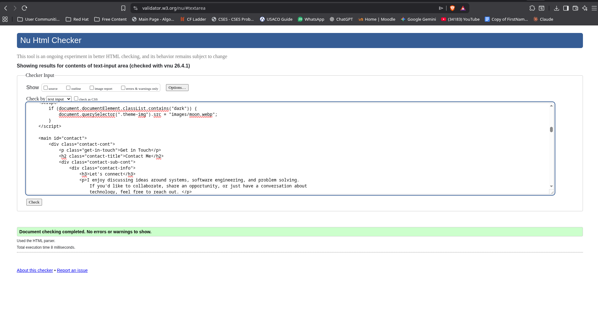

---

### WCAG AA Contrast Compliance

Colour contrast ratios verified for both light and dark themes using the WebAIM Contrast Checker. All text/background combinations meet the WCAG 2.1 AA minimum ratio of 4.5:1 for normal text and 3:1 for large text.

**Light Theme**
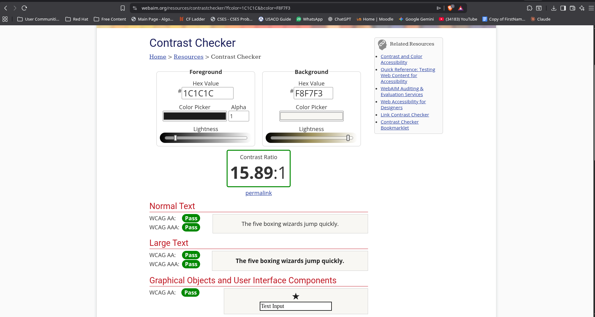
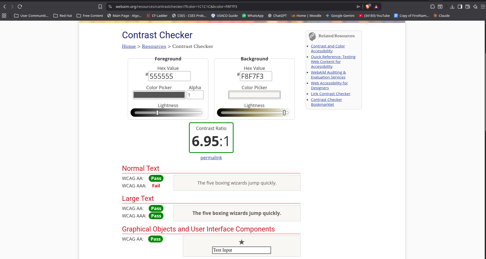
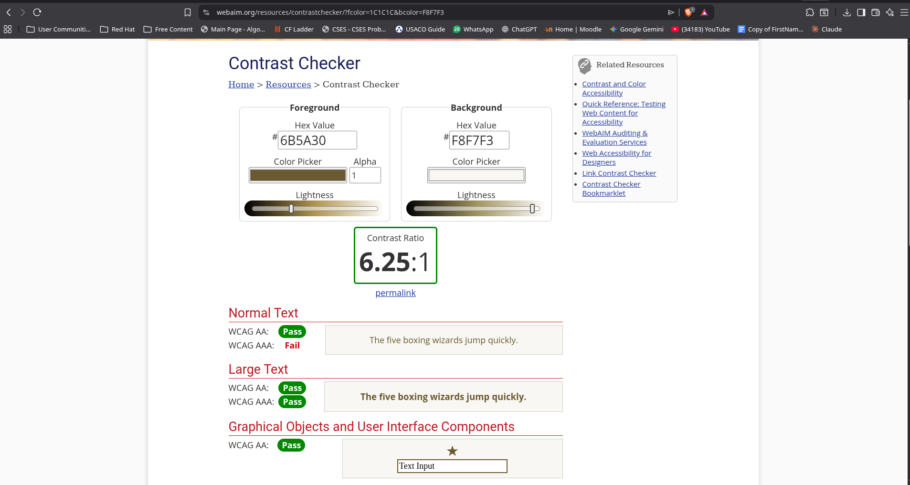

**Dark Theme**
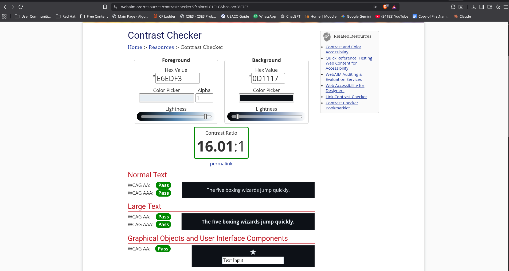
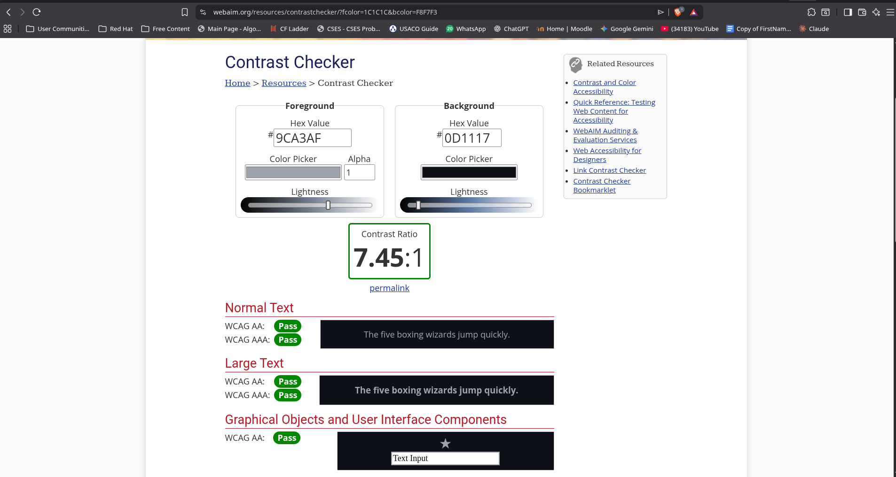
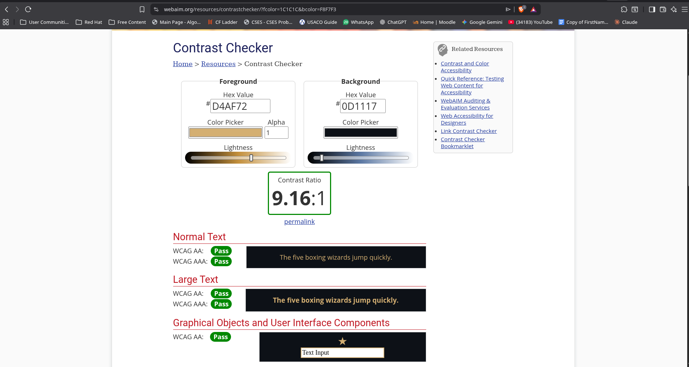

---

## D1 — Site Foundation & Personal Content

All four pages use correct semantic landmark elements throughout: `<header>`, `<nav>`, `<main>`, `<footer>`, `<article>` (timeline cards). `index.html` carries the single `<h1>`; the remaining pages begin at `<h2>` and descend through `<h3>` / `<h4>` as needed.

**About page** contains a personal statement of well over 150 words describing my low-level-first philosophy, current projects, and competitive programming focus. It also includes an interactive five-milestone timeline built from a JavaScript data array injected into the DOM — it is not a static list or image. A real photograph of me is served from `/images/pfp.jpg`.

**Projects page** contains four real projects, each with plain-language answers to: what it does, why I built it, what I would do differently, and what technology tradeoffs I made. One-liners and bullet lists are not used.

**Contact page** validates all three fields client-side before submission is allowed and displays a styled confirmation state on success. No backend is required and none is used.

---

## D2 — Visual Design System

### CSS Custom Property System

All design tokens live in `:root`. No hard-coded colour values exist anywhere outside it.

**Colour palette (semantically named — not `--color1` style):**

```
--bg-color           Page background
--text-color         Primary text
--secondary-text     Muted / supporting text
--text-hover         Gold accent (#8a7340 light / #d4af72 dark)
--accent-color       Interactive blue (#2563eb light / #60a5fa dark)
--success-color      Validation success green
--error-color        Validation error red
--border-color       Borders and dividers
--card-bg            Surface backgrounds
--navbar-bg          Navigation bar surface
--footer-bg          Footer surface
--branch-bg          Terminal branch pill background
```

Both light and dark themes define the full token set independently. No token is left undefined in either theme.

**Font families (four type roles):**

| Role | Variable | Family |
|---|---|---|
| Display | `--font-main` | Monoton |
| Heading | `--font-headers` | Space Grotesk |
| Body | `--font-subs` | Inter |
| Code | `--font-special` | Monospace |

**Font-size scale (`--fs-*` tokens):**

| Token | Value | | Token | Value |
|---|---|---|---|---|
| `--fs-3xs` | 0.6875rem | | `--fs-xl` | 1.4rem |
| `--fs-2xs` | 0.75rem | | `--fs-2xl` | 1.5rem |
| `--fs-xs` | 0.8rem | | `--fs-2xl-lg` | 1.6rem |
| `--fs-sm` | 0.8125rem | | `--fs-3xl-sm` | 1.8rem |
| `--fs-sm-md` | 0.85rem | | `--fs-3xl` | 1.9rem |
| `--fs-md-sm` | 0.875rem | | `--fs-4xl-sm` | 2rem |
| `--fs-md` | 0.9rem | | `--fs-4xl` | 2.2rem |
| `--fs-md-lg` | 0.9375rem | | `--fs-4xl-lg` | 2.3rem |
| `--fs-base` | 0.95rem | | `--fs-5xl` | 2.5rem |
| `--fs-base-lg` | 1rem | | `--fs-6xl` | 3rem |
| `--fs-lg-sm` | 1.1rem | | | |
| `--fs-lg` | 1.2rem | | | |
| `--fs-lg-xl` | 1.25rem | | | |
| `--fs-xl-sm` | 1.3rem | | | |

**Spacing scale (`--space-*` tokens):**

| Token | Value | | Token | Value |
|---|---|---|---|---|
| `--space-0-5` | 0.125rem | | `--space-12` | 1.8rem |
| `--space-1` | 0.25rem | | `--space-13` | 2rem |
| `--space-1-5` | 0.3rem | | `--space-14` | 2.5rem |
| `--space-2` | 0.4rem | | `--space-15` | 2.7rem |
| `--space-2-25` | 0.45rem | | `--space-16` | 3rem |
| `--space-2-5` | 0.5rem | | `--space-17` | 3.5rem |
| `--space-3` | 0.6rem | | `--space-18` | 4rem |
| `--space-3-25` | 0.625rem | | `--space-19` | 5rem |
| `--space-3-5` | 0.7rem | | `--space-20` | 6rem |
| `--space-4` | 0.75rem | | `--space-21` | 8rem |
| `--space-4-5` | 0.8rem | | | |
| `--space-5` | 0.9rem | | | |
| `--space-6` | 1rem | | | |
| `--space-7` | 1.2rem | | | |
| `--space-7-5` | 1.25rem | | | |
| `--space-8` | 1.3rem | | | |
| `--space-9` | 1.5rem | | | |
| `--space-10` | 1.6rem | | | |
| `--space-11` | 1.75rem | | | |

### Typographic Justification

**Monoton** is used exclusively for the typed-text cycling line on the home hero. Its single-stroke geometric letterforms carry a strong signal-processing, circuit-board quality. Because it is used only at this one high-visibility moment, it reads as a deliberate accent rather than a decoration — it communicates "engineering identity" without making body text illegible.

**Space Grotesk** is used for all structural headings and the nav. Its geometric proportions and slightly irregular character shapes (notably the `a`, `g`, and `6`) give it personality beyond a neutral sans-serif, while remaining highly legible at display sizes. It pairs well with Monoton because both share a geometric root without competing.

**Inter** is used for all body text, descriptions, labels, and form inputs. Its optical sizing, wide language coverage, and extensive weight range make it purpose-built for UI reading. It disappears into the content — which is exactly what a body font should do.

**Monospace** (system fallback) is used for terminal output, commit hashes, and branch names. Using the system monospace deliberately keeps the terminal card grounded — it looks like a real terminal, not a styled approximation.

### Light & Dark Themes

The theme is set before first paint by an inline `<script>` in `<head>` that reads `localStorage` and applies `.dark` to `<html>` before the browser renders anything — preventing a flash of the wrong theme.

The toggle button uses a CSS `transition: background 0.4s ease, color 0.4s ease` on `body` to animate between themes in a minimum of 400 ms, satisfying the animation requirement. Theme choice is written to `localStorage` so it persists across sessions.

### Non-Uniform CSS Grid with Explicit Span Values

The footer layout uses a non-uniform three-column grid:

```css
.footer-inner {
    display: grid;
    grid-template-columns: 2fr 1fr 1fr;  /* non-uniform — columns have different widths */
}
```

At the `max-width: 768px` breakpoint, the layout collapses to two columns and the brand block spans the full row using an explicit `grid-column` span value:

```css
.footer-inner {
    grid-template-columns: 1fr 1fr;
}

.footer-brand {
    grid-column: 1 / -1;   /* explicit span — stretches across both columns */
}
```

This is the non-uniform grid using explicit `grid-column` / `grid-row` span values required by D2.

### Responsiveness

All major layout changes at `max-width: 768px`:

1. **Navigation** — hamburger button replaces the inline nav link row. Links collapse into a full-width dropdown that appears below the header when the hamburger is toggled.
2. **Home hero** — switches from a side-by-side flex row (`justify-content: space-between`) to a stacked column (`flex-direction: column; justify-content: center`). Font sizes reduce at three steps (`name-main`, `intro`, `var-line`). The terminal card expands to full container width.
3. **About top section** — the text + image flex row switches to `flex-direction: column-reverse`, placing the photo above the text. The image container caps at `max-width: 250px` and centres.
4. **About timeline** — switches from a centred alternating left/right layout to a single-column layout. The vertical centre line shifts to the left edge (`left: 12px`, `transform: none`). All cards move to full width with a `margin-left: 2.5rem` to clear the line. Horizontal date connectors are hidden (`display: none`). Dates switch from `position: absolute` to `position: static` inline labels.
5. **Tech stack grid** — reduces from `repeat(4, 1fr)` to `repeat(2, 1fr)`. Card padding, icon size, and font size reduce proportionally.
6. **Contact section** — the two-column `grid-template-columns: 1fr 1fr` layout collapses to a single column, stacking the info panel above the form.
7. **Footer** — collapses from `grid-template-columns: 2fr 1fr 1fr` to `grid-template-columns: 1fr 1fr`. The brand block spans both columns via `grid-column: 1 / -1`. The bottom bar switches to `flex-direction: column` with left-aligned items.
8. **Projects accordion** — the project header wraps (`flex-wrap: wrap`) so tags drop below the project name. When a project is open, the image + details switch from a side-by-side row to `flex-direction: column`, with the image going full width and the left border on the details panel replaced with a top border.
9. **Particles canvas** — hidden entirely via `display: none` to avoid painting cost on low-powered mobile devices.

---

## D3 — Motion & Animation

All animation is via CSS `@keyframes` or `transition`. No JavaScript animation libraries are used.

### `prefers-reduced-motion` Handling

```css
/* I used the prefers-reduced-motion media query to detect users who prefer minimal animations.
   I reduced animation duration to near-zero to avoid motion discomfort while still preserving
   layout consistency. */

@media (prefers-reduced-motion: reduce) {
    * {
        animation-duration: 0.01ms !important;
        animation-iteration-count: 1 !important;
        transition-duration: 0.01ms !important;
    }
}
```

Setting durations to `0.01ms` (rather than `0`) preserves the animation-fill-mode end states — elements still end up in their final visible position — while removing all perceivable motion for users who have requested it.

### Hero Entrance Sequence (`@keyframes fadeUp`)

Five elements enter the viewport in a staggered sequence using `animation-fill-mode: both` and incrementally increasing `animation-delay` values (0s, 0.2s, 0.4s, 0.6s, 0.8s):

```
.intro → .name-main → .var-line → .description → .home-icon-cont
```

**What it communicates:** The stagger is not decoration — it guides the reader's eye through the hierarchy of the page in the order the information should be consumed: greeting first, name second, role third, context fourth, social proof last. `animation-fill-mode: both` means each element starts from the animated state (`opacity: 0, translateY(30px)`) before its delay fires, preventing a flash of visible content that then disappears.

### Blinking Cursor (`@keyframes blink`)

The `|` cursor on the typed-text line blinks at 1s intervals.

**What it communicates:** It signals to the user that this is an active, live input area — that the typing animation is in progress and not a static image. It creates the expectation of interactivity.

### Typed Text Cycling (CSS cursor + JS logic)

The role titles cycle via the `TypedText` JS class. The cursor itself blinks via CSS only (`animation: blink 1s infinite`).

**What it communicates:** The roles it cycles through (`Systems Programmer`, `Competitive Programmer`, `C++ Developer`, `Backend Engineer`) are not arbitrary — they represent real facets of my engineering identity. Showing them one at a time with the typing rhythm makes each feel deliberate rather than a dumped tag cloud.

### Timeline Slide-In (Intersection Observer + `@keyframes`)

Cards on the left start `translateX(-50px)` and cards on the right start `translateX(50px)`, both at `opacity: 0`. When the Intersection Observer fires, the `.show` class is applied via CSS `transition: all 0.6s ease`.

**What it communicates:** The opposing slide directions reinforce the alternating left/right layout — each card "arrives" from its natural side of the screen. This spatial relationship makes the layout feel intentional rather than just a visual flourish. The scroll-trigger means the animation happens exactly when the user reaches that point in the narrative, reinforcing the sense of reading through a timeline.

### Tech Stack Pop-In (`cubic-bezier(0.34, 1.56, 0.64, 1)`)

Stack nodes enter with a spring-like overshoot on the Y axis, staggered via `transition-delay: calc(var(--i) * 0.1s)`.

**What it communicates:** The springy easing is the one place on the site where I deliberately used a playful curve. The tech stack section is not a formal milestone — it is a "here is what I work with" inventory. The slight bounce communicates confidence and vitality, which suits that content. I chose `cubic-bezier(0.34, 1.56, 0.64, 1)` specifically because the `1.56` Y overshoot gives a controlled spring without looking careless.

### Contact Section Slide-In (`@keyframes fadeInLeft`, `fadeInRight`)

The info panel enters from the left; the form panel enters from the right.

**What it communicates:** The opposing directions give the two panels spatial identity — they "come from" their respective sides of the layout. This helps users understand that these are two distinct areas of the page (read info vs. write message) before they have read a single word.

### Project Card Scroll Reveal

Project cards reveal with `opacity: 0 → 1` and `translateY(30px → 0)`, with staggered `transition-delay` per `:nth-child`.

**What it communicates:** The stagger reinforces that these are a sequence of items, not a single block. Each card arriving slightly after the previous one encourages the user to read them in order.

### Hamburger → X Transition

The three bars animate to an X via `rotate(45deg)`, `opacity: 0`, and `rotate(-45deg)` on the three `<span>` elements.

**What it communicates:** This is a standard affordance pattern, but the CSS-transition execution matters. A sudden icon swap feels abrupt and breaks the user's confidence that they know what they clicked. The smooth rotation confirms that the menu is now open and the same button closes it.

### Footer Pulse (`@keyframes footer-pulse`)

The green "Available for work" dot pulses between full and reduced opacity.

**What it communicates:** The pulse simulates a live indicator — like an online/active status on a messaging app. It makes the availability signal feel real-time rather than static copy, which is appropriate because the intent is to signal to potential collaborators that I am genuinely reachable.

---

## D4 — JavaScript: Two Non-Trivial Features

**Chosen from Group A: A2 — Session-Persistent Reading Progress**
**Chosen from Group B: B1 — Typed-Text Component**

### A2 — Session-Persistent Reading Progress

Implemented as an ES module (`js/readingProgress.js`) using `import` / `export`. Imported into `about.html` only via `<script type="module">`.

The module tracks scroll depth and writes both the raw `scrollY` value and the computed scroll percentage to `sessionStorage` on every scroll event. On page load, if a saved position exists at more than 5% depth, a styled "resume prompt" slides up from the bottom of the viewport with two buttons: **Resume** (smooth-scrolls to the saved position) and **Start Fresh** (dismisses). The prompt auto-dismisses after 8 seconds.

The progress bar is injected dynamically into `<body>` by the module. Its width is computed from `scrollY / (documentHeight - windowHeight)` and updated live on scroll.

The storage and progress logic live entirely within the module file. The module exports `initReadingProgress`, `getScrollPercent`, `saveScrollPosition`, and `getSavedPosition` — making the logic independently testable.

### B1 — Typed-Text Component

Implemented as a `class TypedText` (not a function) in `js/script.js`. Constructor signature:

```js
new TypedText(element, {
    strings: [...],
    typingSpeed: 100,
    eraseSpeed: 50,
    pauseDuration: 2000
});
```

**State machine:**

| State | Condition | Transition |
|---|---|---|
| Typing | `!isDeleting` | Increment `charidx`, increase `textContent` |
| Pausing | `charidx === string.length && !isDeleting` | Set `isDeleting = true`, wait `pauseDuration` |
| Erasing | `isDeleting` | Decrement `charidx`, decrease `textContent` |
| Advancing | `charidx === 0 && isDeleting` | Set `isDeleting = false`, increment `idx % strings.length` |

The blinking cursor `|` adjacent to the typed text is CSS-only (`@keyframes blink`). The class has no DOM side-effects beyond writing to `element.textContent`.

---

## D5 — Accessibility & Code Quality

### ARIA Attributes

Every interactive JS component carries appropriate ARIA:

- **Hamburger button** — `aria-label="Toggle navigation"`, `aria-expanded` toggled between `"true"` / `"false"` in JS on every click and reset to `"false"` when a nav link is clicked
- **Project accordion toggles** — `aria-expanded` set to `"false"` on render, updated to `"true"` / `"false"` on every open/close in JS
- **Footer social links** — `aria-label` on every `<a>` icon link (e.g. `aria-label="LinkedIn"`, `aria-label="GitHub"`)
- **Decorative `<span>` glows** — `aria-hidden="true"` on both footer glow spans
- **All images** — descriptive `alt` text on every ``. The logo uses `onerror` fallback with `alt="SS"` on the `` and the fallback `<span>` is `style="display:none"` until needed

### Semantic HTML

- Landmark roles used throughout: `<header>`, `<nav>`, `<main>`, `<footer>`
- Heading hierarchy respected: single `<h1>` on index, then `<h2>` section titles, `<h3>` subsections, `<h4>` card titles
- Timeline milestones are `<article>` elements — they are self-contained pieces of content
- Timeline commit hashes use `<code>` — semantically correct for inline code fragments
- Contact form fields have associated `<label for="...">` elements matching every `<input>` and `<textarea>` `id`

### Focus Management

`outline: none` and `outline: 0` are not used anywhere in the stylesheet. Browser default focus rings are preserved on all interactive elements. No focus styles have been suppressed without a replacement.

### No `var` Declarations

All JavaScript uses `const` and `let` exclusively. No `var` is present in any `.js` file.

### Code Quality Conventions

- Consistent 2-space indentation throughout JavaScript files
- Meaningful variable and function names (`create_particles`, `update_particles`, `stackobserver`, `timelineObserver`, `dismissPrompt`)
- Comments on non-obvious decisions:
  - The `prefers-reduced-motion` block includes a comment explaining why `0.01ms` is used instead of `0`
  - The particle canvas setup explains why `canvas.width` must be set explicitly
  - The timeline progress calculation explains the bounding logic
  - `animation-fill-mode: both` usage is commented in the CSS with an explanation of the `forwards` vs `both` distinction
- All logic lives in `.js` files. No inline `<script>` blocks in HTML contain logic (the only inline scripts are the two-line theme-flash prevention and image-swap snippets, which are intentionally placed before first paint)

### Degradation Without JavaScript

All page content is readable without JS. The `<noscript>` element on each page displays a notice. Navigation links are standard `<a>` tags. The contact form renders with all fields visible. The timeline container and projects list are empty shells in HTML and receive content from JS — the `<noscript>` message covers this case.

---

## File Structure

```
/
├── index.html
├── about.html
├── projects.html
├── contact.html
├── css/
│   └── style.css
├── js/
│   ├── script.js
│   └── readingProgress.js
└── images/
    ├── pfp.webp
    ├── sun.webp
    ├── moon.webp
    ├── logo.webp
    ├── dusk.webp
    ├── twixt.webp
    ├── cunplugged.webp
    ├── portfolio.webp
    ├── lighthouse/
    │   ├── lighthouse-index.png
    │   ├── lighthouse-about.png
    │   ├── lighthouse-projects.png
    │   └── lighthouse-contact.png
    ├── w3c/
    │   ├── w3c-index.png
    │   ├── w3c-about.png
    │   ├── w3c-projects.png
    │   └── w3c-contact.png
    └── wcag/
        ├── light-primary.png
        ├── light-secondary.png
        ├── light-hover.png
        ├── dark-primary.png
        ├── dark-secondary.png
        └── dark-hover.png
```

---

## External Dependencies

| Resource | Purpose |
|---|---|
| Google Fonts — Monoton, Space Grotesk, Inter | Typography |
| Font Awesome Kit | Icons (nav, timeline, contact, footer) |
| SimpleIcons CDN (`cdn.simpleicons.org`) | Tech stack SVG logos |

No JavaScript frameworks, CSS frameworks, or animation libraries are used.